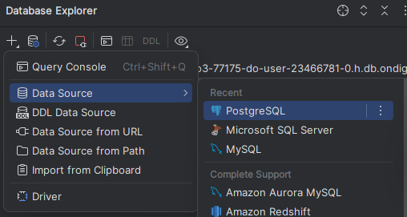
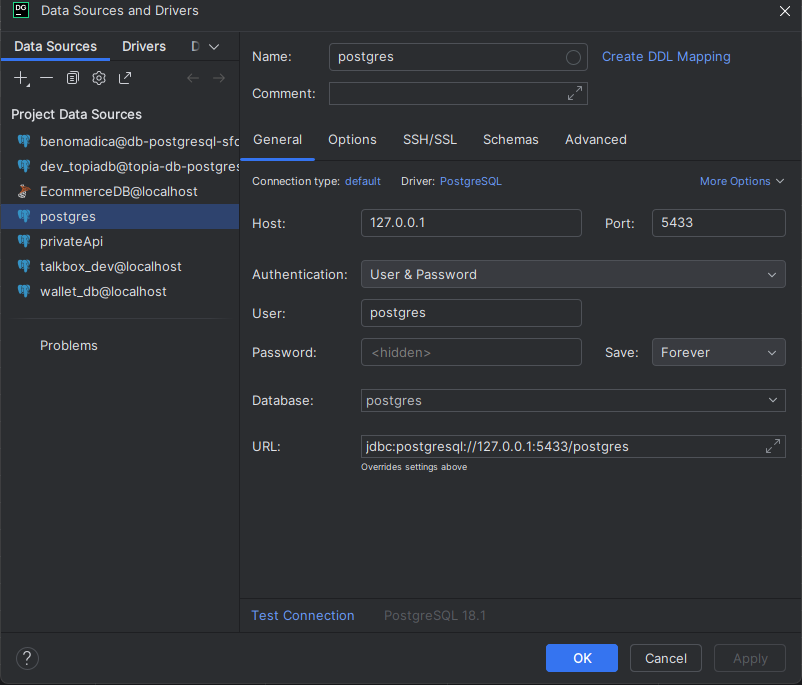
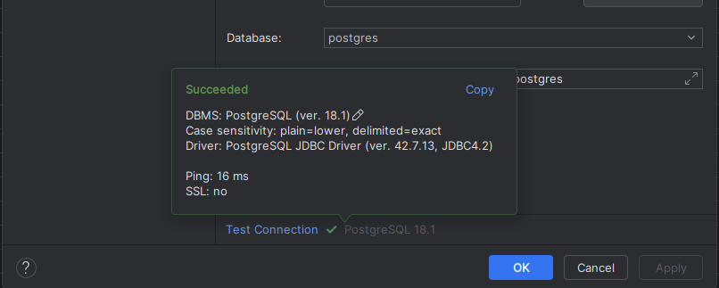

# Desafío Práctico 1 — Datawarehouse y Minería de Datos (UDB)

## Estructura
- `data/train.csv` — archivo fuente original
- `data/cleaned.json` — dataset limpio y normalizado (salida de `clean.ts`)
- `src/explore.ts` — Paso 2: exploración inicial
- `src/clean.ts` — Pasos 3–4: limpieza, normalización y estandarización
- `src/db.ts` — configuración de conexión a PostgreSQL
- `src/load.ts` — Paso 6: inserción de datos (transaccional, con verificación)
- `sql/schema.sql` — Paso 5: script DDL (creación de tablas, PK/FK, índices)
- `sql/business_questions.sql` — Preguntas de negocio (consultas SQL)
- `diagrams/er_diagram.py` — script Graphviz que genera el diagrama entidad-relación
- `output/Desafio_Practico_1_Documento_Tecnico.docx` — documento técnico final

## Cómo ejecutar
```bash
pnpm install
psql -U <usuario> -d <basededatos> -f sql/schema.sql   # O directamente puede user dbeaver para crear las conexion (lo que yo hice en mi caso)
pnpm run explore   # exploración inicial
pnpm run clean     # limpieza y normalización -> data/cleaned.json
pnpm run load      # inserción de datos (requiere variables de entorno PGHOST/PGUSER/PGPASSWORD/PGDATABASE)
psql -U <usuario> -d <basededatos> -f sql/business_questions.sql  # preguntas de negocio
```

## Nota sobre datos
El dataset fuente no incluye una columna de utilidad/costo (Profit); la pregunta de
"rentabilidad" se responde usando el total de Sales como métrica proxy (ver documento técnico, sección 9).


## Conexión con DataGrip

Para crear la base de datos y ejecutar el schema (`sql/schema.sql`) desde el IDE:

### 1. Crear la conexión

En **Database Explorer**, haz clic en **+** → **Data Source** → **PostgreSQL**.



### 2. Configurar los parámetros

En la pestaña **General**, usa los mismos valores que el archivo `.env`:

| Campo    | Valor        |
|----------|--------------|
| Name     | `postgres`   |
| Host     | `127.0.0.1`  |
| Port     | `5433`       |
| User     | `postgres`   |
| Password | `postgres`   |
| Database | `postgres`   |

URL JDBC: `jdbc:postgresql://127.0.0.1:5433/postgres`



### 3. Probar la conexión

Haz clic en **Test Connection**. Deberías ver **Succeeded** con PostgreSQL 18.1.



### 4. Ejecutar el schema

Con la conexión activa, abre `sql/schema.sql` y ejecútalo desde DataGrip (Run o Ctrl+Enter).
